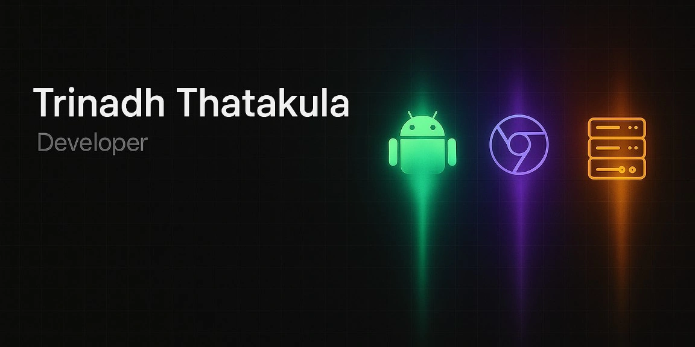

  

<h1 align="center">Hi there, I'm Trinadh Thatakula 👋</h1>

  <b>Senior Mobile Engineer</b> building scalable <b>Android & Cross-Platform (CMP)</b> systems. 
 
Focused on AI-augmented workflows and declarative UI architectures.

  
  
  
  

---

### 🛠️ The Arsenal
I build cross-platform solutions with a focus on type safety, state management, and AI integration.

| **Core & Multiplatform** | **Architecture & State** | **AI & Tooling** |
| :--- | :--- | :--- |
|  |  |  |
| **Compose Multiplatform** | **MVVM / MVI** | **AI-Augmented Workflow** |
| **Kotlin Coroutines** | **Koin (DI)** | **CI/CD Automation** |

---

### 📊 Engineering Metrics

  

---

### 🚀 Flagship Production Apps

| **Thor App Manager** |
| :--- |
|  **The Ultimate App Management Tool (FOSS).** De-bloat, manage, and analyze installed applications with root-level precision. _Part of the Valhalla Project._    |

### 🚀 Recent Projects

- [**trinadhthatakula/Freyr**](https://github.com/trinadhthatakula/Freyr) - A Clean Android FOSS for Weather and other related features
- [**trinadhthatakula/Brokk**](https://github.com/trinadhthatakula/Brokk) - A FOSS Installer for APK, APK&#39;s and XAPK files.
- [**trinadhthatakula/Bolt**](https://github.com/trinadhthatakula/Bolt) - Bolt - Kernel Flasher
- [**trinadhthatakula/hyd2tnm**](https://github.com/trinadhthatakula/hyd2tnm) - A Short infographic on how to reach tiruvannamali from hyd

### 📝 Latest Activity

- [**trinadhthatakula/Freyr**](https://github.com/trinadhthatakula/Freyr) - A Clean Android FOSS for Weather and other related features (5 days ago)
- [**trinadhthatakula/Thor**](https://github.com/trinadhthatakula/Thor) - Thor - Android App Manager and App Installer utility (1 week ago)
- [**trinadhthatakula/SubscriptionTester**](https://github.com/trinadhthatakula/SubscriptionTester) - Google In-App Billing Helper (8.3.0) (2 weeks ago)
- [**trinadhthatakula/Extensions-kt**](https://github.com/trinadhthatakula/Extensions-kt) - A repository for all extensions which I use on a daily basis (2 weeks ago)
- [**trinadhthatakula/Brokk**](https://github.com/trinadhthatakula/Brokk) - A FOSS Installer for APK, APK&#39;s and XAPK files. (3 weeks ago)

   
<i>This profile updates automatically every 24h. Last update: &lt;nil&gt;</i>

