  

<h1 align="center">Hi there, I'm Trinadh Thatakula 👋</h1>

  <b>Senior Android Engineer</b> specialized in building reactive, state-driven mobile applications.

  
  
  

---

### 🛠️ Architectural Focus
I don't just write code; I build systems. My current stack emphasizes **Modern Android Development (MAD)**:

| Core | UI / UX | Architecture |
| :--- | :--- | :--- |
|  |  | **MVVM / MVI** |
| **Coroutines & Flow** | **Jetpack Compose** | **Koin (DI)** |

---

### 📊 Engineering Metrics

  

---

### 🚀 Recent Projects

- [**trinadhthatakula/Bolt**](https://github.com/trinadhthatakula/Bolt) - Bolt - Kernel Flasher
- [**trinadhthatakula/hyd2tnm**](https://github.com/trinadhthatakula/hyd2tnm) - A Short infographic on how to reach tiruvannamali from hyd
- [**trinadhthatakula/poi-gen**](https://github.com/trinadhthatakula/poi-gen) - Jar generator for Apache POI to be used in android
- [**trinadhthatakula/Loki**](https://github.com/trinadhthatakula/Loki) - Android App logger

### 📝 Latest Activity

- [**trinadhthatakula/Extensions-kt**](https://github.com/trinadhthatakula/Extensions-kt) - A repository for all extensions which I use on a daily basis (today)
- [**trinadhthatakula/Loki**](https://github.com/trinadhthatakula/Loki) - Android App logger (4 days ago)
- [**trinadhthatakula/Thor**](https://github.com/trinadhthatakula/Thor) - Thor - Android App Manager and App Installer utility (1 month ago)
- [**trinadhthatakula/Bolt**](https://github.com/trinadhthatakula/Bolt) - Bolt - Kernel Flasher (4 months ago)
- [**trinadhthatakula/hyd2tnm**](https://github.com/trinadhthatakula/hyd2tnm) - A Short infographic on how to reach tiruvannamali from hyd (6 months ago)

   
  <i>This profile updates automatically every 24h. Last update: &lt;nil&gt;</i>

